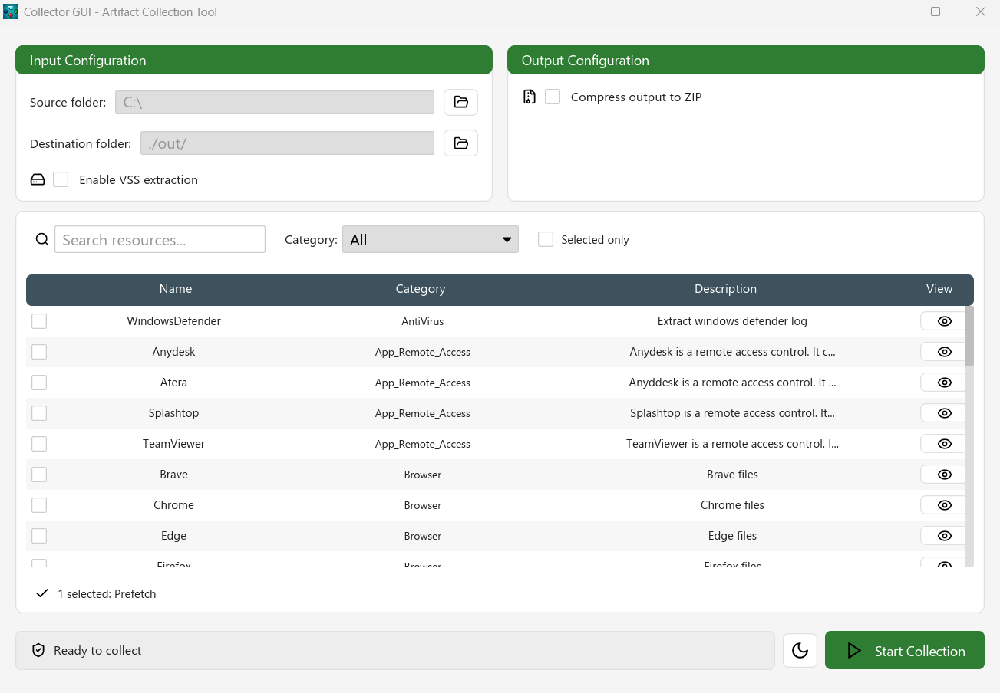
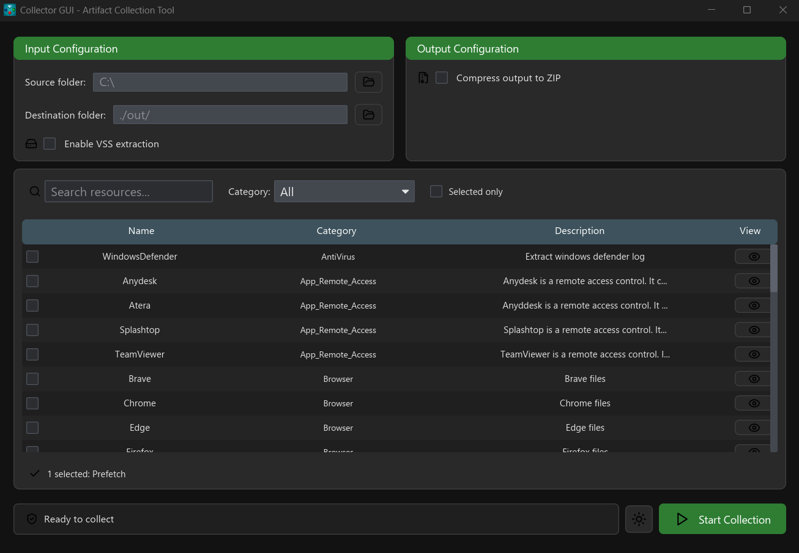

# Collector

This tool can collect different artifact on running system.
It collects data quickly and securely and is open source in Rust🦀.

## 🧩 How to use it (CLI Version)

To use this tool, you need to go to [release page](https://github.com/gems-ir/Collector/releases) of this project and donwload the lastest release.
After that, download the [resources](#resources) files to use it.
You can follow the [help command](#help_cmd) to personalize execution or you can run the binary as administrator on your computer.
Path exemple to use: 

```
./my_folder
 |-- collector_gui(.exe)
 |-- collector_cli(.exe)
 |-- collector_config_windows.toml
 |-- collector_config_linux.toml
 |-- Resources
        |-- AntiVirus
        |-- Browser
        |-- ...
```

## 🧩 GUI Version

| White mode                                                                 | Dark mode                                                                 |
| -------------------------------------------------------------------------- | ------------------------------------------------------------------------- |
|  |  |

## 📚Resources {#resources}

You can download the collection resources here: [https://github.com/gems-ir/Resources](https://github.com/gems-ir/Resources)

```bash
git clone https://github.com/gems-ir/Resources.git
```

## 🆘 Help command {#help_cmd}

```bash
This tool was an artefact collector fast and secure. It can collect low level files.
Usage: collector_cli.exe [OPTIONS] [COMMAND]
Commands:
  resources  Resource list options
  help       Print this message or the help of the given subcommand(s)
Options:
  -s, --source <SOURCE>
          The source path of collecting artifact [default: C:\]
  -d, --destination <DESTINATION>
          The destination path of collecting artifact [default: output\]
  -r, --resources <RESOURCES>
          Resources selection. You can list with "resources" command. Example: MFT,Prefetch,EVTX [default: All]
  -p, --path-resources <PATH_RESOURCES>
          Path to artifact resources [default: Resources\]
      --zip
          Zip the output directory
      --pass <PASS>
          Set zip password
      --vss
          Collect from vss. (Take more time)
  -c, --config <CONFIG>
          Use config file
      --log
          Print log output in terminal. (longer)
  -v, --verbose
          Verbose log
  -h, --help
          Print help
  -V, --version
          Print version
```

## 👨‍💻 Features

- [x] Low-level file collection
- [x] VSS (Collect from volume shadow copy on Windows)
- [x] Archive in ZIP format with a password
- [x] Embeded config file and resources into binary to execute in click and launch mode.
- [x] GUI
- [ ] Send to a remote server
- [ ] Adaptive collection
- [ ] Memory collection
- [ ] MacOS collection
- [ ] Android collection
- [ ] Create driver